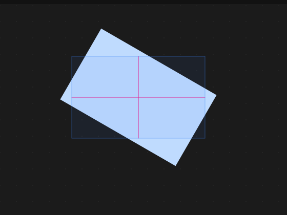
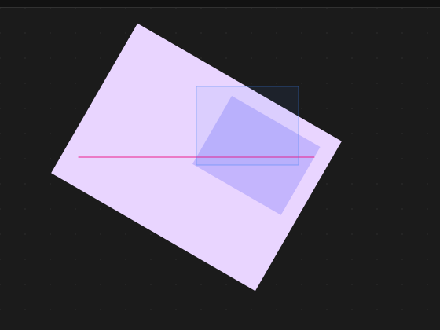
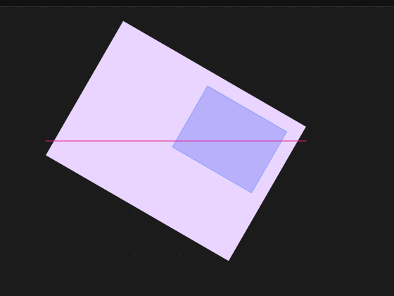
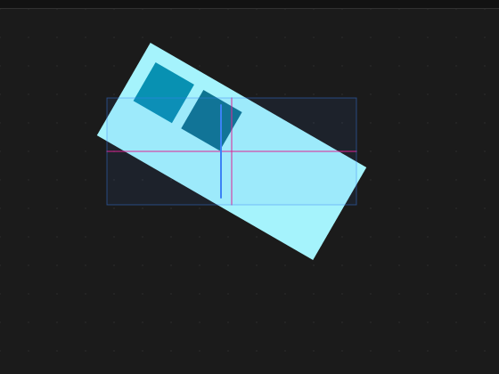
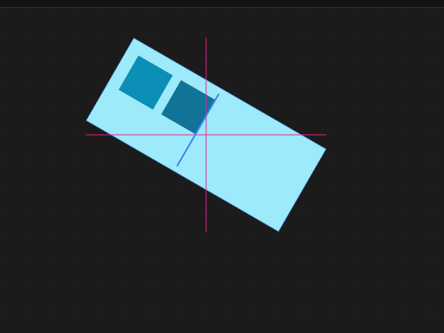
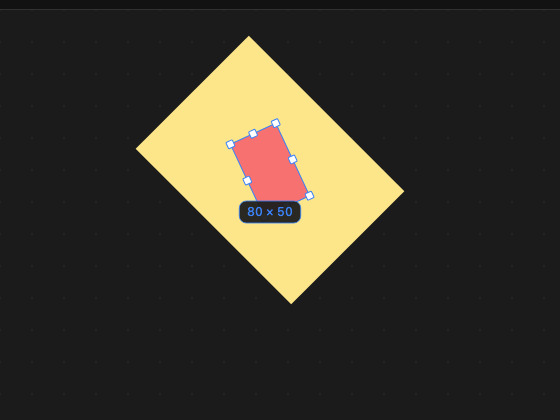
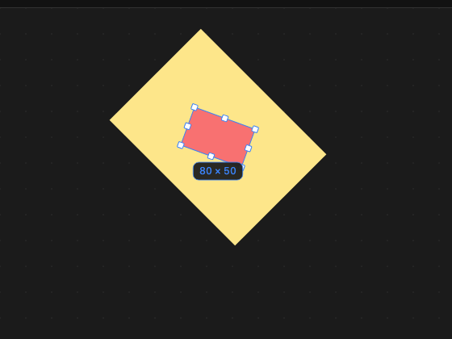

# 我只是想让一个框跟着转，结果顺手修了十几个 bug

> 一次画布旋转问题的排查复盘。不讲大道理，只讲踩过的坑。
>
> 项目是 [OpenPencil](https://github.com/ZSeven-W/openpencil)，一个用 Rust 写的开源矢量设计工具。

## 事情是这样的

有人问我：在画布上把元素 A 拖进元素 B，要是 A 或 B 转了个角度，拖放时那个高亮框，是不是还是"正"的？

我心想：多大点事，给框加个旋转，五分钟搞定。

然后我截了张图：

浅蓝色是转了 30° 的 B。那个方方正正的暗色框，就是"你要把东西放进这里"的提示。它压根没跟着转。

这是第一个 bug。顺着它往下查，又挖出来十几个。

## 先搞懂一件事：画布上的东西是怎么"转"起来的

打个比方。

你有一块转盘，上面贴着贴纸。转盘（父级）一转，上面的贴纸（子级）自然跟着转；贴纸自己还可以再歪一点。

编辑器存数据也是这个思路，每个元素只记两样东西：

- **没转的时候**，它在父级里的位置和大小；
- 它自己**歪了多少度**。

真正"转"起来，是在画到屏幕上的那一刻：先把父级转好，再在父级转好的基础上画子级。

所以同一个元素，其实有两个"真相"：

- 数据里说：我在 (500, 200)，宽 120、高 80；
- 屏幕上看：它斜躺在另一个地方。

编辑器里所有跟"屏幕上长什么样"打交道的功能，比如画选中框、判断鼠标点中了谁、算放下去的位置，都得先把数据里的位置换算成屏幕上的位置。

选中框早就这么干了，拖放这一路却全程忘了。**这就是十几个 bug 的共同病根。**

## 坑 1：框是正的

病根讲清楚了，修法也直白：提示框的数据里本来只有 x、y、宽、高，没地方放角度，那就加一个角度字段，画的时候先转再画。

难的是把角度和位置都算对。比如 B 自己没转，但它的父级 C 转了 30°，那 B 在屏幕上既歪了，还被带着挪了位置。修之前是这样的，深紫色那块才是 B，框压根没对上：

修完之后：

auto-layout 容器里那根"插到这里"的蓝色竖线也是一样，修之前笔直地立着：

修完之后跟着容器一起歪：

## 坑 2：放进去之后，元素自己多转了一下

框对了，松手，元素"咔"地又转了一下。

一个 20° 的元素，放进 45° 的容器，变成了 65°：

原因还是那张贴纸：元素记的角度是"相对父级歪了多少"。放进新容器时直接把原来的 20° 照搬过去，容器再给它加上 45°，就成了 65°。

修法：放进去之前先减掉。新容器转了 45°，想让它在屏幕上还是 20°，那它在容器里就该记成 −25°。

位置也是同样的道理：放进一个转了 45° 的容器，要先把屏幕上的位置"逆着转回去"，再换算成相对容器的坐标，不然元素会在你松手的一瞬间瞬移。

> **为什么不直接加减角度？**
>
> 一开始我也以为角度直接加减就行，直到遇到翻转：父级水平翻转之后，子级往左歪，屏幕上看是往右歪。
>
> 所以代码里并不直接加减角度，而是把每一层的"翻转 + 旋转 + 绕哪个点转"写成一个矩阵，从最外层一路乘到当前元素，最后再从矩阵里读出角度。多一层翻转、多一层嵌套都不怕，而且位置和角度是一起算出来的。

## 坑 3：你以为放进去了，其实没有

判断"鼠标底下是哪个容器"，用的也是没转时的矩形。

于是 B 转过之后，有两块区域对不上：

- 转出去的那个角，看着明明是 B，程序说不是；
- 转走后空出来的那块，看着明明是空白，程序却说是 B。

修法：把鼠标位置按 B 的角度"逆着转回去"，放到 B 没转时的坐标里再判断。这样命中范围就和眼睛看到的形状一模一样了。

## 坑 4：从转过的盒子里往外拖，元素走歪了

在一个转了 30° 的容器里拖子元素，鼠标往右，元素却往右下斜着走。

原因是元素的 x、y 记在容器"转过的坐标系"里。你在屏幕上往右移 10 像素，程序就在容器的坐标里往右加 10，而容器的"右"是斜的。

就像在一张歪放的纸上沿着纸边画线：你以为画的是水平线，把纸摆正一看，是斜的。

修法：屏幕上的移动距离，先按容器的角度转回去，再加到元素的坐标上。键盘方向键的微移没改，它本来就应该沿着容器自己的方向走。

## 坑 5：吸附参考线"鬼打墙"

这个坑跟旋转关系不大，是排查时一起暴露出来的。

拖动元素时，靠近别的元素会被"吸"一下对齐。原来的实现有个问题：吸附时它把"鼠标上一次的位置"往回退，却没有把已经吸过去的那段距离退掉。于是每经过一次吸附，元素和鼠标之间就多出一截偏差。我写的测试里，分 12 步拖过去，最后元素比鼠标偏了整整 50 像素。

改成记住"当前被吸了多少"，下一次移动前先把这段还回去，再重新判断要不要吸。

顺带一提，参考线对齐的也不再是没转时的矩形，而是转过之后的外接框。

## 坑 6：图层树不刷新

"拖进父级之后，左边的图层树没变。我把父节点收起来，它才跑进去。"

这是个很典型的缓存问题。图层树的数据是缓存着的，靠"文档版本号"判断要不要重算。拖进父级这一步改了文档，却忘了把版本号加一，缓存就一直以为什么都没变。收起节点换了一个缓存条件，这才碰巧刷新了。

修法就一行：改完树结构，记得告诉大家"文档变了"。

## 坑 7：缩放手柄，箭头不对、拖了不动、对边乱跑

一个转了 90° 的矩形，右边的手柄其实跑到了下面。可是：

- 鼠标放上去，箭头还是 ↔；
- 往下拖，宽度纹丝不动，因为程序只看横向移动；
- 如果矩形在一个转过的父级里，手柄干脆点不中。

前两个好修。箭头按手柄在屏幕上的实际朝向来选（系统只有 ↔ ↕ ↘↖ ↗↙ 四种，挑最接近的那个）；拖动距离先换算到元素自己的方向上再用。

真正有意思的是第三件事：**元素是绕中心转的，改尺寸会让中心移动。**

你拖右边把它拉宽，中心就往右挪了，而整个元素又是绕新中心转的。结果左边那条本该不动的边，在屏幕上也跟着跑了。

解决办法是"钉住对边"：先记下对边中点改尺寸之前在屏幕上的位置，再算出改完之后它跑到了哪儿，差多少，就把整个元素挪回去多少。这样拖右边的时候，左边就稳稳地钉在原地。

## 第二轮："还是不对啊"

修完一轮，收到反馈：带角度的元素放进带角度的 frame，角度还是对不上。

这回我没急着改，先写了个探针，把几种可能挨个跑了一遍：

- 在画布上拖进去：角度是对的；
- **在左侧图层面板里拖进去：角度错了。** 这条路径和画布拖放是两套代码，它没做任何换算。20° 的元素进了 45° 的 frame 变成 65°，位置也跳了，连不转的 frame 都会跳；
- **旋转手柄**：用的中心点不对，在转过的 frame 里拖着转 30°，实际只转了 14°；
- 椭圆的弧度手柄、路径的锚点、文字的光标：放进转过的 frame 之后，全都点不中。

后面这几个其实是同一个病：只把元素自己的角度"转回去"了，没管它的父级们。于是我写了一个统一的函数，专门把"屏幕上的点"换算成"元素自己坐标里的点"，把这几处手写的换算全换掉。以后再加新功能，直接调它就行，不用每次再手写一遍。

## 最后一刀：frame 会自己长大

查图层面板那条路径时，有个测试差了 70 多像素。追下去才发现：一个 220×160 的 frame，把子元素放到它外面之后，它自己长成了 350×300。

原来布局算完之后，还有一段"修正"逻辑：没开裁剪的 frame，会被撑大到把所有子元素都包进去，哪怕它的尺寸是写死的数字。这段逻辑本来是为了兼容早期 AI 生成的文件，那时候的尺寸是估出来的，经常估小。

但对旋转来说，这是致命的：frame 是绕自己的中心转的，它一长大，中心就挪了，frame 和里面的所有东西都会跟着在屏幕上漂。对普通编辑来说也很反直觉，在 Figma 里，固定尺寸的 frame 永远不会因为子元素超出去而变大。

最后定下来的规则，是完全照着 Figma 来：**写死的尺寸就是写死的，超出去的内容就让它超出去**，顶层画板也不例外。想让 frame 跟着内容变大，就把尺寸设成"适应内容"（fit-content，也就是 Figma 里的 Hug contents），这种情况照旧会自动长。

这一刀下去，牵动的比想象中多。顶层画板本身会裁剪内容，AI 生成长页面时，先铺一块 390×844 的手机画板，再一段段往下填内容。以前画板会自己长高，现在不会了，844 以下的内容就被裁掉看不见了。预览模式里的页面滚动、给页面底部留白的清理步骤，也都悄悄依赖着"画板会自己长"。

所以生成流程也跟着改了：

- **应用内的 AI 生成**：每插入一段内容，就把画板的高度拉到内容的底部，边生成边能看到完整页面；如果用户在需求里写明了尺寸，就尊重用户，不去改它。
- **给页面底部留白**：以前只加一段底部内边距，指望画板自己长高；现在加完内边距再量一次，不够就把画板拉高补上。
- **外部 AI（通过 MCP 接入）**：设计指南里本来就要求最后把页面的根改成 fit-content，这次补了一句：数值高度是固定的，内容一旦超过占位高度，就要把占位加高，或者直接切到 fit-content。收尾步骤也还会兜底，把画板高度调到内容的高度。

代价也要说清楚：早期生成的文件里，如果哪张卡片的尺寸估小了，内容现在会溢出边框；长页面的画板如果是写死的高度，超出的部分会被裁掉，需要把高度改成 fit-content，或者手动拉高。

## 怎么确认这次真的修干净了

每个 bug 都是先写一个"会失败的测试"，确认它确实是因为这个 bug 才失败，再去改代码，改到测试通过为止。

测试跑的是桌面端的同一套代码：按下、拖动、松手，走的都是用户真实操作的那条路径；检查的是"屏幕上实际画出来的位置和角度"，而不是数据里的某个字段。

有几次测试失败，查下来并不是 bug，这几个经验也值得记一笔：

- **差了 2.6 像素**：元素被吸附到了参考线上，这是正常行为。测试应该检查"松手前后有没有跳"，而不是"是不是正好停在鼠标底下"。
- **差了 0.6 像素**：布局会把位置对齐到整数像素，转了 45° 之后，不到 1 像素的取整误差会反映到屏幕上。
- **期望点中"起点手柄"，结果点中了"终点手柄"**：一个完整的椭圆，这两个手柄本来就叠在同一个位置，设计上就是后画的那个优先。
- **差了 70 多像素**：这回是真 bug，就是上面那个"frame 自己长大"。

## 写在最后

回头看，这十几个 bug 其实只有一个病根：**屏幕上看到的，和数据里记的，不是一回事。**

框是正的、放下去会转、点不中、拖着走歪、手柄方向不对……全都是有人把"数据里的位置"当成了"屏幕上的位置"。

真正让修复变简单的，是先把"数据换算到屏幕"这件事做成一个随手可用的工具。有了它，大部分修复就只剩一件事：把某一行手写的换算，换成调用这个工具。

如果你也在做画布类的编辑器，记住三句话就够了：

1. 用任何一个位置之前，先问一句：这是屏幕上的，还是数据里的？
2. 换算要沿着整条父子链算，别只算自己那一层。
3. 东西是绕中心转的，尺寸一变，中心就会跟着动。
